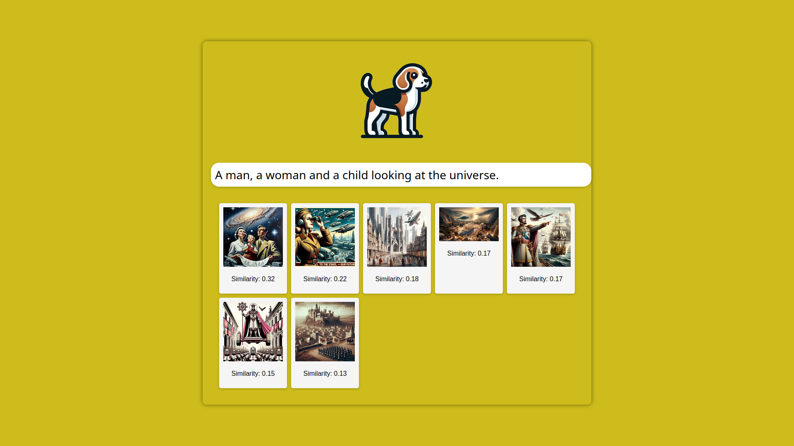

# Beagle

A tool for finding what you are looking for.

## The idea

For many years, when trying to find some text in a document, we had to remember the exact phrasing for ```CTRL-F``` to work. We might have gotten away with a typo if the search was more advanced, but we were never able to search *semantically*, that is to say, we were never able to search for objects that have the same meaning, even if they have different names.

**Beagle** is an image search engine that uses CLIP to embed semantically close texts and images into the same latent space, allowing the user to search for an image by describing what is in that image. Beagle computes the embedding of a query text, which is just a vector, and compares it to the embeddings of the images in the users database. 

This way, a user can search for one of his images semantically.

## Demo



## Roadmap
- Implement GUI
    - Add basic web front end ✔️
    - Add slidebar for filtering by similarity ☐
- Pagination for results ☐
- Play around with other embedders ☐
- Try other similarity measures ☐